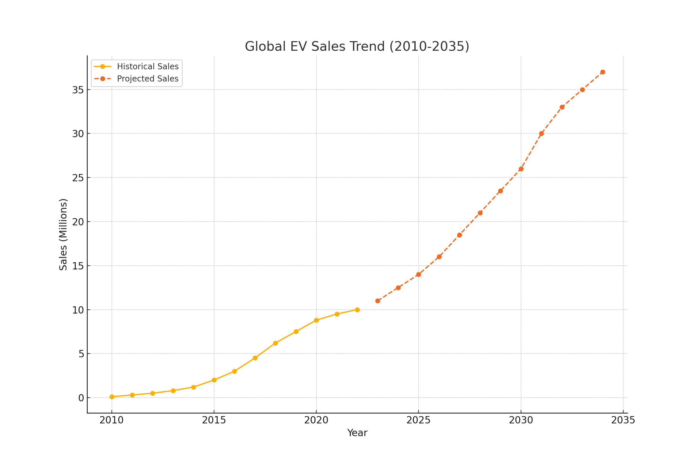

# EV Adoption Case Study

This repository contains a detailed analysis of regional EV adoption trends. The case study highlights high-growth regions, challenges in low-growth regions, and actionable recommendations for stakeholders.

## Files
- **Case Study PDF**: [Download here](./Final_Enhanced_Case_Study_With_Images_And_Fixed_Encoding.pdf)
- **Visuals**:
  - Global EV Sales Trend:  
    
  - Regional Market Share:  
    
  - Growth Comparison:  
    
  - Infrastructure vs. Adoption:  
    

## Key Highlights
- **Top Regions**: China, Europe, and the USA dominate EV sales.
- **High-Growth Areas**: India and Rest of the World show exponential growth potential.
- **Low-Growth Barriers**: Infrastructure and policy gaps hinder adoption in specific regions.

## Recommendations
- Expand infrastructure with public-private partnerships.
- Introduce consumer awareness campaigns.
- Incentivize affordable EV models in emerging markets.

## License
Open for educational and research purposes under the MIT License.
